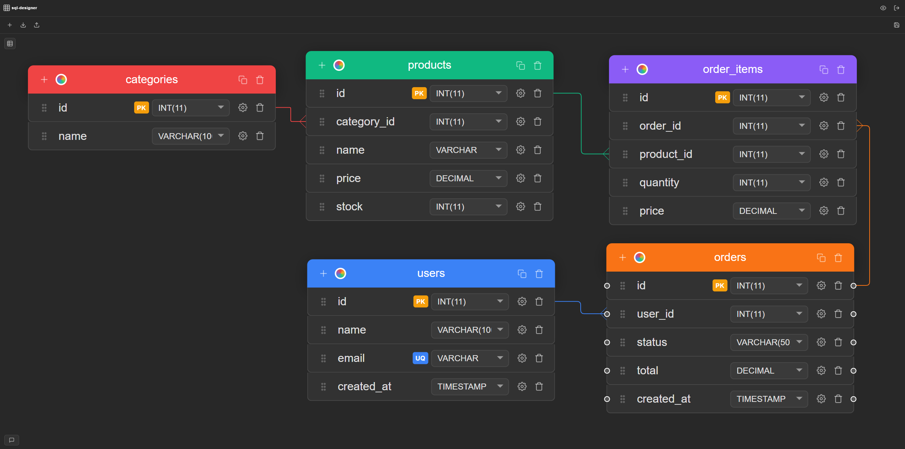

# SQL Designer

**SQL Designer** is a free, web-based visual database schema designer. Design and manage your database schemas through an intuitive drag-and-drop interface — no SQL expertise required.

🌐 **Live app:** [sql-designer.com](https://sql-designer.com)

---

## Why SQL Designer?

Most database design tools are either expensive, desktop-only, or require an account just to get started. SQL Designer runs in your browser, free, and gets you from idea to schema in seconds.

- **No install** — runs entirely in the browser
- **Visual-first** — drag, drop, and connect tables without writing SQL
- **Bidirectional SQL** — import existing SQL to visualize it, or export clean `CREATE` statements from your diagram
- **MySQL & PostgreSQL** — full support for both dialects
- **Open source** — read the code, report bugs, suggest features

---

## Features

- **Visual diagram editor** — design schemas on an interactive canvas with drag-and-drop support
- **Table & column management** — create, rename, and delete tables and columns inline
- **Relationship visualization** — connect tables with relationship lines using crow's foot notation
- **Support for MySQL, PostgreSQL, SQLite, Oracle, SQL Server, and MS Access** — choose your target database type per diagram
- **SQL import & export** — generate SQL `CREATE` statements from your diagram, or import existing SQL to auto-build a diagram
- **Save & manage diagrams** — store multiple diagrams per account with auto-save
- **User accounts** — register and log in to keep your diagrams private and persistent

---

## Stack

| Layer    | Technology             |
|----------|------------------------|
| Frontend | Vue 3, Pinia, Vue Flow |
| Backend  | Laravel 11 (PHP)       |
| Database | PostgreSQL             |
| Infra    | Docker, Nginx          |

---

## Contributing

Contributions are welcome. Please open an issue first to discuss what you'd like to change.

1. Fork the repository
2. Create a feature branch (`git checkout -b feature/my-feature`)
3. Commit your changes
4. Open a pull request

---

## License

This project is source-available. See [LICENSE](./LICENSE) for details.

**Author:** Snyatkov Dmitriy Andreevich
**Contact:** dmitriy@sql-designer.com
